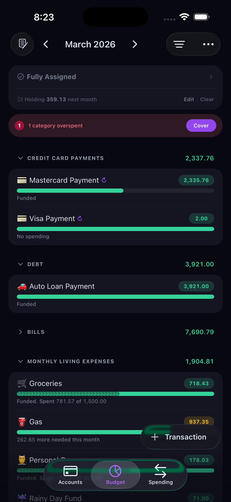

# Actual Budget Mobile — Landing Page

Landing page for **Actual Budget Mobile**, the privacy-first budgeting app for iOS. Built with Astro and deployed on Cloudflare Workers.



## Tech Stack

- **Astro 6** — Static site generation with server-side API routes
- **Cloudflare Workers** — Edge deployment via `@astrojs/cloudflare` adapter
- **Cloudflare D1** — SQLite database for waitlist signups
- **GSAP + ScrollTrigger** — Scroll-triggered animations and micro-interactions
- **i18n** — English and Spanish with prefix-based routing (`/` and `/es/`)

## Project Structure

```
src/
├── components/       # Astro components (Navbar, Hero, Features, etc.)
├── i18n/             # Translation files (en.json, es.json)
├── layouts/          # Base HTML layout
├── pages/
│   ├── api/          # Waitlist API endpoint (D1)
│   ├── es/           # Spanish pages
│   └── index.astro   # English homepage
├── scripts/          # GSAP animations
└── styles/           # Global CSS + design tokens
public/
├── fonts/            # Web fonts
└── images/           # iOS simulator screenshots (light + dark)
db/
└── schema.sql        # D1 waitlist table schema
```

## Getting Started

```bash
npm install
npm run dev           # http://localhost:4321
```

## Deployment

### 1. Create the D1 database

```bash
npx wrangler d1 create actual-waitlist
```

Update `wrangler.jsonc` with the returned `database_id`.

### 2. Run the migration

```bash
npx wrangler d1 execute actual-waitlist --file=./db/schema.sql
```

### 3. Build and deploy

```bash
npm run build
npx wrangler deploy
```

## Features

- Responsive design with mobile-first approach
- Light/dark screenshot gallery with toggle
- GSAP scroll animations with `prefers-reduced-motion` support
- Waitlist form with email validation and duplicate detection
- Bilingual support (EN/ES)

## License

MIT
